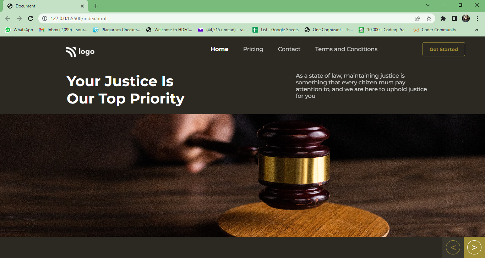

# Law Home Page 

This is a front end project done with the help of HTML and CSS only.
***
### Name: SOURITA RAY
***
## Demo

## What have I learnt in this project?

In this project I have got in-depth knowledge about 
- Background properties of CSS like background images, background color, background positions etc.
- Selectors like class selector and first-child or nth-child selector.

## Time required to complete the project

About 5 hours.
## Live link

[Law Home Page](https://law-home-page-souritaray.netlify.app/)

## Contact me on:

- [Linked In-Sourita Ray](www.linkedin.com/in/sourita-ray-89bab0212)
- [Email-id Sourita Ray](souritaray@gmail.com)

## Feedback

You can provide your feedback at souritaray@gmail.com

